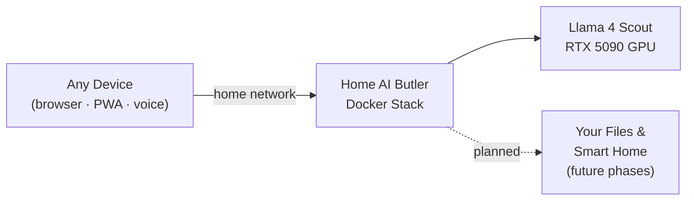

# Home AI Assistant

A self-hosted, fully local AI butler running on your home network. Built on [Onyx](https://github.com/onyx-dot-app/onyx) (open-source RAG platform) with [Ollama](https://ollama.com) serving [Llama 4 Scout](https://ai.meta.com/blog/llama-4/) on your GPU — no data ever leaves your network.

Every device on your WiFi (PC, laptop, phone) connects to a single URL and gets a full AI assistant with awareness of your local files and network shares.

---

## System Design



---

## Stack

| | |
|---|---|
| LLM | Llama 4 Scout via Ollama |
| RAG + Chat UI | Onyx |
| Vector Search | Vespa |
| Database | PostgreSQL |
| GPU | RTX 5090 (NVIDIA Container Toolkit) |

---

## Prerequisites

- Docker + Docker Compose
- NVIDIA Container Toolkit (for GPU passthrough)
- NVIDIA driver ≥ 570.x (required for Blackwell / RTX 5090)
- CUDA 12.8+

Verify GPU passthrough works before starting:

```bash
docker run --rm --gpus all nvidia/cuda:12.8.0-base-ubuntu22.04 nvidia-smi
```

---

## Usage

```bash
# 1. One-time setup: generates .env secrets + pulls Llama 4 Scout
bash scripts/init.sh

# 2. Start the full stack (Vespa takes ~2 min on first boot)
docker compose up -d

# 3. Open the UI
# Local:   http://localhost
# Network: http://<your-host-ip>
```

On first load:
1. **Create your admin account** — email and password for `AUTH_TYPE=basic`
2. **Skip connector setup** — add file sources later
3. **Verify the LLM** — Admin → LLM Providers → confirm `ollama / llama4:scout`
4. **Start chatting** — first response is slower while the model loads into VRAM

---

## Smoke Tests

```bash
bash scripts/test.sh

# Verbose (shows raw API responses):
bash scripts/test.sh --verbose
```

Covers: container health (10 services), all endpoints, model availability, live GPU inference with tokens/sec, and `nvidia-smi` inside the Ollama container.

---

## Specs

Detailed design and implementation plans live in [`specs/`](specs/):

- [functional-spec.md](specs/functional-spec.md) — what the system does
- [design-spec.md](specs/design-spec.md) — how it behaves
- [technical-spec.md](specs/technical-spec.md) — how it's built
