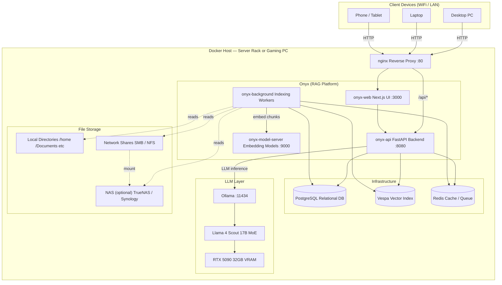

# Home AI Assistant

A self-hosted, fully local AI butler running on your home network. Built on [Onyx](https://github.com/onyx-dot-app/onyx) (open-source RAG platform) with [Ollama](https://ollama.com) serving [Llama 4 Scout](https://ai.meta.com/blog/llama-4/) on your GPU — no data ever leaves your network.

Every device on your WiFi (PC, laptop, phone) connects to a single URL and gets a full AI assistant with awareness of your local files and network shares.

---

## System Design



---

## Architecture Overview

| Layer | Component | Role |
|---|---|---|
| **Reverse Proxy** | Nginx | Single entry point for all clients on the network |
| **UI** | Onyx Web (Next.js) | Chat interface, connector config, admin panel |
| **API** | Onyx Backend (FastAPI) | RAG orchestration, query routing, auth |
| **Workers** | Onyx Background | Crawls and indexes connected file sources |
| **Embeddings** | Onyx Model Server | Converts text chunks to vectors for semantic search |
| **Vector Store** | Vespa | Stores and searches document embeddings |
| **Database** | PostgreSQL | Users, connectors, conversation history |
| **Cache** | Redis | Task queue for background jobs |
| **LLM Serving** | Ollama | Hosts Llama 4 Scout, GPU-accelerated inference |
| **Model** | Llama 4 Scout | 17B active-param MoE, fits in 32GB VRAM |

---

## Prerequisites

- Docker + Docker Compose
- NVIDIA Container Toolkit (for GPU passthrough)
- NVIDIA driver ≥ 570.x (required for Blackwell / RTX 5090)
- CUDA 12.8+

Verify GPU passthrough works before starting:

```bash
docker run --rm --gpus all nvidia/cuda:12.8.0-base-ubuntu22.04 nvidia-smi
```

---

## Quick Start

```bash
# 1. Clone / enter the project
cd home_ai_assistant

# 2. One-time setup: generates .env secrets + pulls Llama 4 Scout
bash scripts/init.sh

# 3. Start the full stack
docker compose up -d

# 4. Open the UI
# Local:   http://localhost
# Network: http://<your-host-ip>
```

---

## Smoke Tests

```bash
bash scripts/test.sh

# Verbose output (shows raw API responses):
bash scripts/test.sh --verbose
```

Tests cover: container health, all service endpoints, model availability, live GPU inference (reports tokens/sec), and `nvidia-smi` inside the Ollama container.

---

## Configuration

All config lives in `.env` (generated from `.env.example` by `init.sh`):

| Variable | Default | Description |
|---|---|---|
| `LLM_MODEL` | `llama4:scout` | Primary Ollama model for chat + RAG |
| `LLM_FAST_MODEL` | `llama4:scout` | Model for lightweight tasks (routing, classification) |
| `AUTH_TYPE` | `disabled` | Set to `basic` or `google_oauth` for multi-user |
| `WEB_DOMAIN` | `http://localhost` | Public URL — update to your host IP for LAN access |
| `LOG_LEVEL` | `info` | `debug` for development |

---

## Indexing Local & Network Files

Mount host paths into the indexing services in `docker-compose.yml`:

```yaml
# Under api_server and background services:
volumes:
  - /home/user/Documents:/mnt/indexed/documents:ro
  - /mnt/pc2:/mnt/indexed/pc2:ro          # pre-mounted SMB/NFS share
```

Then add a **Local File connector** in the Onyx admin UI pointing at `/mnt/indexed/`.

---

## Deployment Phases

```
Phase 1 (Now)      Run on gaming PC for local dev and testing
Phase 2            Move stack to homelab rack — same compose file, update WEB_DOMAIN
Phase 3            Add Tailscale for secure remote access outside the home
Phase 4            Add NAS, persistent memory, home automation integrations
```

---

## Network Access

To make the assistant reachable by name instead of IP:

- **Static IP** — assign a DHCP reservation in your router for the host machine
- **Local DNS** — run Pi-hole or AdGuard Home and add an `A` record: `butler.local → <host-ip>`
- **Outside home** — install [Tailscale](https://tailscale.com) on the host; no port forwarding needed

---

## Security Notes

- Set `AUTH_TYPE=basic` (or stronger) before exposing to more than one user
- Volume mounts use `:ro` (read-only) — the container cannot modify your files
- Exclude sensitive paths from indexing (`.ssh`, credential files, browser profiles)
- Never expose ports 8080, 11434, 19071, or 5432 directly to the internet
