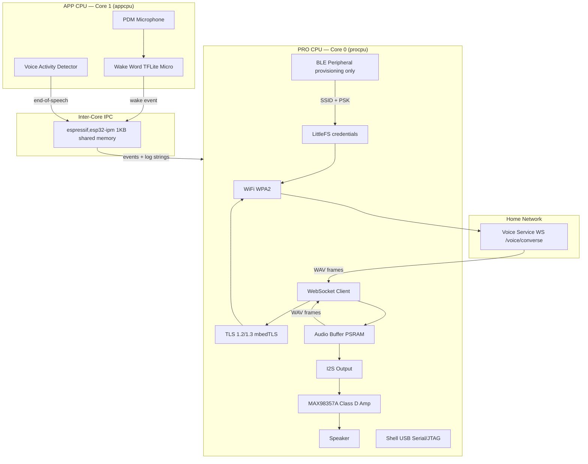

# Voice Node

The Voice Node is a standalone ambient voice device built on the Seeed XIAO ESP32S3 Sense. It runs Zephyr RTOS 4.3.0 across both LX7 cores in an AMP (Asymmetric Multi-Processing) configuration, connects to the home network over WiFi, and speaks with the [Voice Service](../../services/voice/) via a TLS WebSocket.

The device listens continuously for a wake word (TFLite Micro on Core 1), then streams PCM audio to the server for transcription, sends it through the LLM, and plays back the synthesised TTS response through a MAX98357A Class D amplifier. No cloud dependencies — everything runs on the local network.

---

## System Design



---

## Architecture

### AMP — Two Independent Images

The ESP32-S3 is a dual-core LX7. Zephyr 4.3.0 does not implement SMP on this chip, so each core runs a separate Zephyr image built together by `west sysbuild` and flashed to separate flash partitions.

| Core | Image | Responsibilities |
|---|---|---|
| PRO CPU — Core 0 | `procpu` | WiFi, TLS, WebSocket, I2S playback, BLE provisioning, shell |
| APP CPU — Core 1 | `appcpu` | PDM mic capture, wake word inference, VAD |

### Inter-Core Communication (IPM)

Cores communicate via `espressif,esp32-ipm` — a shared memory mailbox with a 1KB payload slot. The driver does not queue messages; each send must complete before the next.

Current IPM message IDs:

| ID | Direction | Payload | Purpose |
|---|---|---|---|
| 0 | appcpu → procpu | `char[]` log string | Forward appcpu log lines; procpu prints with `[C1]` prefix |
| 1 | procpu → appcpu | `uint8_t` (1=start, 0=stop) | BOOT button press/release → start/stop PDM capture |
| 2 | appcpu → procpu | `uint32_t` byte_count | PDM capture complete; procpu reads PSRAM audio buffer |

Future IDs will carry wake word events and end-of-speech signals once TFLite Micro and VAD are added.

### WebSocket Wire Protocol

The device speaks the same `WS /voice/converse` protocol as the web client. See [Voice Service](../../services/voice/README.md) for the full protocol definition. Device-specific behaviour:

```
Device → Server:
  TEXT    { "type": "config", "tts": true, "audio_format": "wav", "sample_rate": 16000 }
  BINARY  WAV audio chunks (16kHz, 16-bit, mono)
  TEXT    { "type": "end_audio" }

Server → Device:
  TEXT    { "type": "transcript", ... }   ignored — no display
  TEXT    { "type": "token", ... }        ignored — no display
  BINARY  WAV audio frame (one sentence)  queued for I2S playback
  TEXT    { "type": "done" }
  TEXT    { "type": "error", ... }        plays error chime, returns to IDLE
```

### Device State Machine

```
IDLE  ──(wake word)──▶  WAKE  ──(WS connected)──▶  RECORDING
                                                         │
                                              silence / button / timeout
                                                         │
                                                         ▼
                                                      WAITING
                                                         │
                                                  first WAV frame
                                                         │
                                                         ▼
                                                      PLAYING ──(done + drained)──▶ IDLE

Any state: WS close / error → error chime → IDLE
```

---

## Directory Structure

```
embedded/voice_node/
├── Makefile                     # sysbuild wrappers: make / make flash / make menuconfig
├── README.md
├── specs/
│   ├── functional-spec.md       # what the device does
│   ├── design-spec.md           # architecture, state machine, audio flows
│   └── technical-spec.md        # BOM, Kconfig, flash layout, build commands
├── overlays/                    # DTS overlays passed explicitly via -DDTC_OVERLAY_FILE
│   ├── procpu.overlay           # ipm0 enable, BOOT button (GPIO0, sw0 alias)
│   └── appcpu.overlay           # ipm0, DMA, I2S0 PDM pinctrl (GPIO41 CLK, GPIO42 DATA)
├── procpu/                      # PRO CPU image (Core 0)
│   ├── CMakeLists.txt
│   ├── sysbuild.cmake           # registers appcpu as remote image
│   ├── prj.conf                 # Kconfig: IPM, WiFi, TLS, WebSocket, I2S, shell
│   └── src/
│       ├── main.c               # entry point, IPM receive, blink loop
│       ├── storage.c            # LittleFS mount + credential read/write
│       ├── button.c/h           # BOOT button: GPIO interrupt → k_work → IPM CMD
│       └── audio.c/h            # PSRAM pointer, cache invalidate, log_audio_samples()
└── appcpu/                      # APP CPU image (Core 1)
    ├── CMakeLists.txt
    ├── prj.conf                 # Kconfig: IPM, DMA, I2S, PSRAM (OPI)
    └── src/
        ├── main.c               # entry point, IPM command handler, orchestration
        └── pdm.c/h              # I2S PDM init, DMA slab, pdm_record(), cache flush
```

---

## Hardware

| Component | Purpose | Est. cost |
|---|---|---|
| Seeed XIAO ESP32S3 Sense | MCU, 8MB OPI PSRAM, PDM mic, WiFi, BLE | ~$14 |
| MAX98357A I2S amplifier | I2S DAC + Class D amp, 3.3W into 4Ω | ~$3 |
| Speaker (4Ω, 2W) | Audio output | ~$3 |
| USB-C power supply | 5V mains | ~$5 |

I2S amplifier wiring:

```
XIAO ESP32S3    MAX98357A
  GPIO 2  ───── BCLK
  GPIO 3  ───── LRCLK
  GPIO 4  ───── DIN
  3.3V    ───── VIN
  GND     ───── GND
```

---

## Build and Flash

All commands run inside the Dev Container (`embedded/.devcontainer/`).

```bash
cd /zephyr-ws/embedded/voice_node

make                    # sysbuild: procpu + appcpu + MCUboot
make clean && make      # full rebuild
make menuconfig         # interactive Kconfig (procpu image)
make flash              # west flash -d build
```

For prototype builds with hardcoded WiFi credentials, create `procpu/credentials.conf` (gitignored):

```kconfig
CONFIG_WIFI_SSID="YourNetwork"
CONFIG_WIFI_PSK="YourPassword"
```

Pass it at build time:

```bash
west build --sysbuild -d build -b xiao_esp32s3/esp32s3/procpu/sense procpu \
  -- -Dprocpu_EXTRA_CONF_FILE=credentials.conf
```

### Serial Monitor

```bash
picocom /dev/ttyACM0    # baud rate ignored — USB Serial/JTAG
```

Shell prompt: `uart:~$`. Both cores' log output appears here — procpu logs are prefixed `[C0]`, appcpu logs forwarded via IPM are prefixed `[C1]`.

---

## Key Design Decisions

- **AMP over SMP** — Zephyr 4.3.0 does not implement `arch_cpu_start` for the ESP32-S3, making SMP unavailable. AMP with sysbuild gives full independent control of each core, avoids the shared-scheduler complexity of SMP, and maps cleanly to the workload split: Core 0 owns I/O, Core 1 owns inference.
- **IPM for logging** — The USB Serial/JTAG peripheral is owned by the procpu driver. The appcpu cannot write to it independently (flush mechanism is driver-controlled). Instead, the appcpu formats log strings and sends them to the procpu via IPM, which prints them. One send per log call with `wait=1` prevents the single shared-memory slot from being overwritten before the procpu reads it.
- **Server-side STT/LLM/TTS** — Whisper, Ollama, and Piper run on the server. The device only streams raw audio and plays back WAV. This keeps firmware complexity low and lets the server be upgraded independently.
- **No persistent WebSocket** — The connection opens on wake and closes after playback drains. Idle state carries no open socket, which simplifies reconnection and reduces power draw.
- **OPI PSRAM** — The XIAO ESP32S3 uses Octal PSRAM. `CONFIG_SPIRAM_MODE_OCT=y` is required; the default Quad mode causes a boot crash.
- **I2S DMA always stereo** — The ESP32-S3 I2S DMA controller only operates in stereo (`channels=2`); `channels=1` is rejected with `EINVAL`. The mono PDM mic outputs on the left channel; the right channel carries zeros. WAV streaming strips alternate samples before sending.
- **PSRAM cache coherency** — Both cores access PSRAM through independent L1 data caches with no hardware coherency. After `pdm_record()` writes the capture buffer, appcpu calls `sys_cache_data_flush_range()` before sending the IPM done signal. procpu calls `sys_cache_data_invd_range()` before reading, ensuring it sees appcpu's data rather than its own stale cache lines.

---

## Milestones

| # | Scope | Status |
|---|---|---|
| 0 — Scaffold | Both cores boot (AMP); procpu blinks LED + shell; appcpu heartbeat via IPM | **Done** |
| 1 — PDM capture | BOOT button (interrupt-driven) → appcpu captures PDM to shared PSRAM → procpu reads + validates via cache-safe IPM handshake | **Done** |
| 2 — Network | WiFi + TLS handshake + WebSocket open + text round-trip | **Done** |
| 3 — Mic → Server | WAV framing from PSRAM, WebSocket streaming, server transcribes correctly | — |
| 4 — Server → Speaker | Receive WAV frames, I2S playback through MAX98357A | — |
| 5 — Full round-trip | End-to-end: speak → hear response | — |
| 6 — Wake word | TFLite Micro on appcpu replaces BOOT button trigger | — |
| 7 — VAD | RMS silence detection replaces fixed timeout | — |
| 8 — Provisioning | BLE GATT provisioning, NVS credential storage | — |
