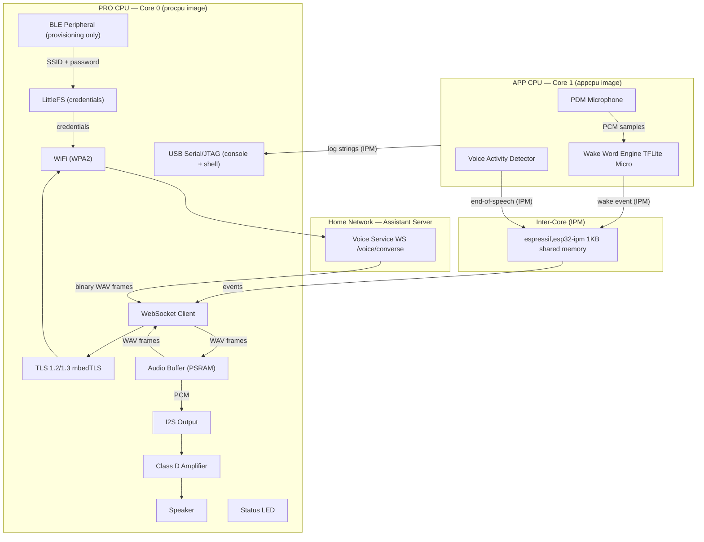

# Design Specification — Ambient Voice Node

**Status:** Draft
**Version:** 0.1
**Derives from:** [functional-spec.md](functional-spec.md)

---

## 1. System Architecture

### 1.1 Core Assignment (AMP)

The ESP32-S3 is a dual-core LX7. Zephyr 4.3.0 does not implement SMP on this chip, so each core runs an independent Zephyr image (Asymmetric Multi-Processing). The two images are built together via sysbuild and flashed to separate partitions.

| Core | Image | Responsibility |
|---|---|---|
| PRO CPU — Core 0 | `procpu` | WiFi, TLS, WebSocket, audio I/O, BLE provisioning, shell |
| APP CPU — Core 1 | `appcpu` | Wake word inference (TFLite Micro), VAD |

Inter-core communication uses the `espressif,esp32-ipm` Zephyr driver. The shared memory slot is 1KB; the driver does not queue messages — each send must complete before the next. Log output from the appcpu is forwarded to the procpu via IPM and printed there with a `[C1]` prefix.

### 1.2 Component Overview



### 1.3 Responsibilities Split: Device vs Server

| Responsibility | Where it runs |
|---|---|
| Wake word detection | Device |
| Voice activity detection (end-of-speech) | Device |
| Audio capture and buffering | Device |
| Audio streaming to server | Device |
| Speech-to-text (Whisper) | Server |
| LLM inference | Server |
| Text-to-speech (Piper) | Server |
| TTS audio playback | Device |
| WiFi provisioning | Device (BLE) |

---

## 2. Device State Machine

```
┌─────────────────────────────────────────────────────────────────────┐
│                              IDLE                                   │
│  PDM mic sampling continuously at low duty cycle                   │
│  Wake word model running on CPU                                     │
│  WiFi associated; WebSocket closed                                  │
└──────────────────────┬──────────────────────────────────────────────┘
                       │ wake word detected
                       ▼
┌─────────────────────────────────────────────────────────────────────┐
│                              WAKE                                   │
│  Play acknowledgement chime via I2S                                 │
│  Open WSS /voice/converse to server                                 │
│  Send config message                                                │
└──────────────────────┬──────────────────────────────────────────────┘
                       │ WebSocket connected
                       ▼
┌─────────────────────────────────────────────────────────────────────┐
│                           RECORDING                                 │
│  PDM mic → PCM samples → PSRAM audio buffer                        │
│  Stream binary WAV frames to server continuously                    │
│  VAD monitors RMS amplitude for silence                             │
└──────────┬───────────────────────────────────────────┬─────────────┘
           │ silence detected (VAD)                    │ max duration
           │ or user taps button                       │ elapsed
           └─────────────────┬─────────────────────────┘
                             │ send end_audio message
                             ▼
┌─────────────────────────────────────────────────────────────────────┐
│                            WAITING                                  │
│  Receive transcript message — ignored (no display)                  │
│  Receive token messages — ignored                                   │
│  Receive binary WAV frames — enqueue in PSRAM playback buffer       │
│  Receive done message — signal playback end                         │
└──────────────────────┬──────────────────────────────────────────────┘
                       │ first WAV frame received
                       ▼
┌─────────────────────────────────────────────────────────────────────┐
│                            PLAYING                                  │
│  Dequeue WAV frames from PSRAM buffer                               │
│  Strip WAV header; feed raw PCM to I2S → amp → speaker             │
│  Continue receiving remaining frames while playing                  │
└──────────────────────┬──────────────────────────────────────────────┘
                       │ done received + playback drained
                       ▼
                     IDLE

Error path (any state):
  WebSocket close / server error / timeout
    → play error chime
    → close WebSocket
    → return to IDLE
```

---

## 3. Audio Flows

### 3.1 Capture → Server

```
PDM mic (16kHz, 16-bit, mono)
  → raw PCM samples in PSRAM ring buffer
  → construct WAV header (44 bytes) for accumulated buffer
  → send binary WebSocket frames to Voice Service
  → VAD running in parallel: monitor RMS amplitude
  → silence threshold crossed for N consecutive frames → send end_audio
```

### 3.2 Server → Playback

```
Server sends binary WebSocket frame (one sentence = one frame)
  → receive into PSRAM playback buffer
  → parse sample rate from WAV header bytes 24–27
  → configure I2S output clock for parsed sample rate
  → feed raw PCM to I2S driver
  → I2S → MAX98357A → speaker
  → next frame begins immediately after current drains
```

Playback starts on the first received frame — the device does not wait for all frames before playing. This minimises the perceived latency between the end of the user's query and the start of the spoken response.

---

## 4. WiFi Provisioning Flow

Provisioning is triggered by holding the BOOT button at startup. On subsequent boots, credentials are read from LittleFS and the provisioning step is skipped entirely.

```
Normal boot (credentials in NVS)
  → read SSID + password from NVS
  → connect to WiFi
  → enter IDLE state

Provisioning boot (BOOT button held at startup, or no credentials in NVS)
  → advertise as BLE peripheral ("Butler-Node")
  → wait for phone/browser to connect
  → receive SSID written to characteristic 1
  → receive password written to characteristic 2
  → save to NVS
  → stop BLE advertisement
  → connect to WiFi
  → enter IDLE state

Re-provisioning (change network)
  → hold BOOT button at startup
  → same flow as above — overwrites existing NVS credentials
```

BLE advertisement is only active during the provisioning window. The device never advertises during normal operation.

---

## 5. Status Indication Design

The device has no display. User feedback is delivered through audio chimes only. The LED is used for development and diagnostic purposes.

### 5.1 Audio Chimes

| Event | Chime |
|---|---|
| Wake word detected | Short rising two-tone chime (~200ms) |
| Error / connection failure | Short descending tone (~300ms) |

Chime audio files are baked into firmware flash at build time. No external storage needed.

### 5.2 LED (diagnostic)

| State | LED pattern |
|---|---|
| Booting | Fast blink |
| Provisioning (BLE active) | Slow pulse |
| WiFi connecting | Medium blink |
| IDLE (normal operation) | Solid on |
| RECORDING | Double-blink |
| PLAYING | Solid on |
| Error | Three rapid flashes |

---

## 6. Reconnection and Resilience

- **WiFi drop:** Zephyr network management layer handles reconnection automatically. If a query is in progress, the WebSocket close triggers the error path (error chime → idle).
- **Server unreachable:** WebSocket connect attempt times out → error chime → idle. Retried on next wake word.
- **WebSocket close mid-query:** Error chime → idle. The next wake word opens a fresh WebSocket connection.
- **No persistent connection:** The WebSocket is opened on wake and closed when the turn completes. Idle state carries no open socket.

---

## 7. Deployment Architecture by Milestone

| Milestone | Scope | Status |
|---|---|---|
| **0 — Scaffold** | Both cores boot, LED blinks (procpu), both cores log over shared USB serial via IPM, shell accessible on procpu | Done |
| **1 — Network** | WiFi connects, TLS handshake succeeds, WebSocket opens to server, text round-trip works | **In progress** |
| **2 — Mic → Server** | PDM capture, WAV framing, audio streamed to server, server transcribes correctly | — |
| **3 — Server → Speaker** | Binary WAV frames received, I2S playback through amp and speaker | — |
| **4 — Full round-trip** | Button-triggered (not wake word): speak, hear response end-to-end | — |
| **5 — Wake word** | TFLite Micro model replaces button trigger | — |
| **6 — VAD** | Energy-based silence detection replaces fixed timeout | — |
| **7 — Provisioning** | BLE provisioning flow replaces hardcoded credentials | — |
