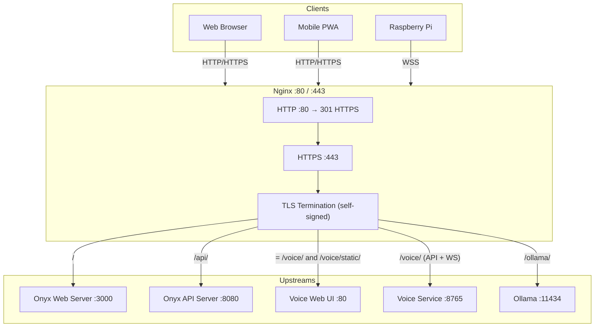

# Nginx Service

The Nginx service is the TLS-terminating reverse proxy and single entry point for all Home AI Assistant traffic. It terminates HTTPS, routes requests to the appropriate upstream service, and handles WebSocket upgrades for streaming LLM responses and voice chat.

On first start, the container auto-generates a self-signed TLS certificate (stored in a named Docker volume) so no manual certificate setup is required. The certificate is reused on all subsequent container restarts.

---

## System Design



---

## Routing Table

| Path | Priority | Upstream | Notes |
|---|---|---|---|
| `/` | default | `web_server:3000` | Onyx Next.js UI; WebSocket upgrade forwarded |
| `/api/` | prefix | `api_server:8080` | Onyx REST API; buffering disabled for streaming |
| `= /voice/` | exact | `webui:80` | Voice UI HTML page (highest nginx priority) |
| `/voice/static/` | prefix | `webui:80` | Hashed JS/CSS assets; long-lived cache headers set upstream |
| `/voice/` | prefix | `voice-service:8765` | Voice API + WebSocket; lazy DNS so nginx starts before voice-service |
| `/ollama/` | prefix | `ollama:11434` | Direct Ollama API access; restrict in production |

### nginx Location Priority

nginx applies location blocks in this order for a given request path:

1. **Exact match** (`= /voice/`) — checked first, wins immediately if matched
2. **Longest prefix match** (`/voice/static/`) — wins over shorter prefixes
3. **General prefix** (`/voice/`) — catches everything else under `/voice/`

This ordering ensures the HTML page and static assets are served from the `webui` container while WebSocket and API calls reach `voice-service`.

---

## TLS Certificate

The certificate is generated automatically by [entrypoint.sh](entrypoint.sh) on the container's first start:

- Stored at `/etc/nginx/certs/` inside the `nginx_certs` named volume
- 2048-bit RSA, 10-year validity, Subject Alternative Name set to `CERT_HOSTNAME`
- Uses an OpenSSL config file for SAN — required because Alpine's LibreSSL does not support `-addext`
- On subsequent starts the cert files are detected and generation is skipped

To change the hostname, set `CERT_HOSTNAME` in your `.env` file (default: `vulcan.local`).

To force regeneration (e.g. after changing `CERT_HOSTNAME`):

```bash
docker volume rm onyx_nginx_certs
docker compose up -d nginx
```

### Browser Trust

Because the cert is self-signed, browsers will show a security warning on first visit. Proceed past the warning or install the cert as a trusted CA in your browser / OS trust store:

```bash
# Copy cert from volume to host
docker compose cp nginx:/etc/nginx/certs/selfsigned.crt ./selfsigned.crt
# Then import selfsigned.crt into your browser/OS certificate store
```

---

## Directory Structure

```
services/nginx/
├── Dockerfile       nginx:alpine + openssl; custom entrypoint
├── entrypoint.sh    Auto-generates self-signed TLS cert on first start
└── nginx.conf       Reverse proxy config (mounted read-only into container)
```

---

## Key Design Decisions

- **Self-contained cert generation** — The cert is generated inside the container on first start and persisted in a named volume. No host-side prerequisites or manual setup steps are needed before `docker compose up`.
- **LibreSSL config file** — Alpine's nginx image uses LibreSSL, which does not support `openssl req -addext`. A config file with a `[v3_ca]` section is used instead to set the Subject Alternative Name, which is required for modern browsers to accept the cert.
- **`openssl` via apk** — `nginx:alpine` links against libssl but does not ship the `openssl` CLI. The Dockerfile adds it via `apk add --no-cache openssl`.
- **Lazy DNS for voice-service** — The `/voice/` API/WS block uses `resolver 127.0.0.11` and a `set $voice_upstream` variable. This defers DNS resolution at request time so nginx can start successfully even if `voice-service` is not yet healthy.
- **Static upstreams for critical services** — `web_server` and `api_server` use static `upstream {}` blocks. These services are required dependencies of nginx (`depends_on`) so they are always resolvable at startup.
- **Buffering disabled on streaming routes** — `/api/` and `/voice/` disable `proxy_buffering` and set long read/send timeouts (300 s) to support SSE-streamed LLM tokens and real-time WebSocket audio.
