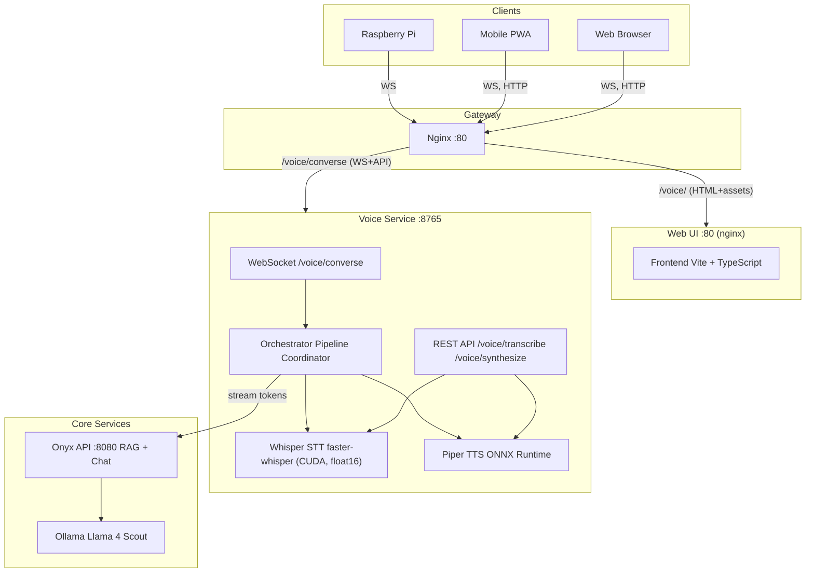
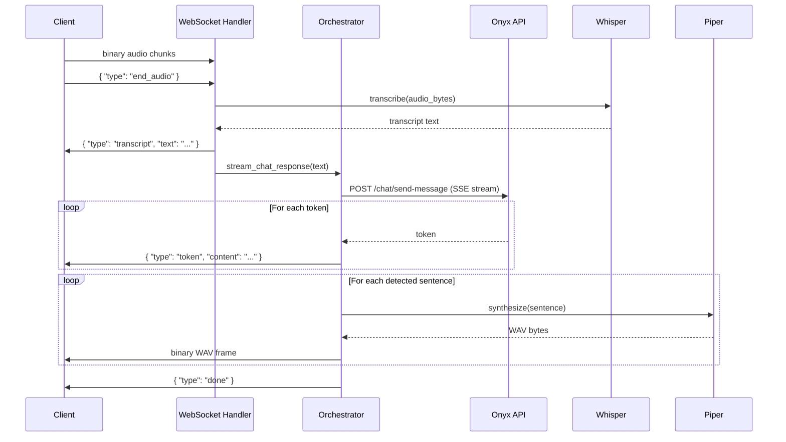

# Voice Service

The Voice Service is a pure API backend providing speech-to-text (STT), text-to-speech (TTS), and real-time voice chat for the Home AI Assistant. Its companion frontend lives in [`services/webui`](../webui/).

It exposes a WebSocket-based conversational API that any client — web browser, mobile PWA, or Raspberry Pi agent — can use to send audio or text and receive streamed LLM responses with synthesized speech. The service runs Whisper (via faster-whisper) for transcription and Piper for neural TTS, both on GPU. A server-side orchestrator handles the full STT → LLM → sentence detection → TTS pipeline so clients only need to speak the WebSocket wire protocol.

---

## System Design



---

## Architecture

### WebSocket Wire Protocol

A persistent WebSocket at `WS /voice/converse` handles full-duplex voice chat:

```
Client → Server:
  TEXT    { "type": "config", "tts": true }          optional, sent on connect
  TEXT    { "type": "text_input", "message": "..." }  text query
  BINARY  raw audio bytes (webm/opus chunks)          voice query
  TEXT    { "type": "end_audio" }                     signals recording done

Server → Client:
  TEXT    { "type": "transcript", "text": "..." }     STT result
  TEXT    { "type": "token", "content": "..." }       LLM streaming token
  BINARY  WAV audio bytes                             TTS for one sentence
  TEXT    { "type": "done" }                          turn complete
  TEXT    { "type": "error", "detail": "..." }        on failure
```

### Pipeline Flow


---

## Directory Structure

```
services/voice/
├── Dockerfile           Python-only build (CUDA runtime, no Node.js)
├── .gitignore
└── src/                 FastAPI application and pipeline logic
    ├── main.py          App entry, health + REST endpoints (API-only)
    ├── converse.py      WebSocket endpoint, message dispatch, TTS worker
    ├── orchestrator.py  Onyx API client, NDJSON parsing, sentence detection
    ├── transcribe.py    Whisper STT (faster-whisper, CUDA, float16)
    ├── synthesize.py    Piper TTS (ONNX Runtime, WAV output)
    └── requirements.txt Python dependencies
```

The companion frontend lives in [`services/webui`](../webui/) — see its README for structure and design.

## Key Design Decisions

- **WebSocket over SSE** — Native binary frames avoid base64 overhead for audio. Bidirectional for Pi agent streaming.
- **Server-side orchestration** — The STT → LLM → TTS pipeline runs on the server so every client shares the same API. No client reimplements orchestration logic.
- **Concurrent TTS** — Sentence boundary detection runs during LLM streaming. Each sentence is synthesized in a background worker via `asyncio.Queue` while the LLM continues generating. TTS runs in `asyncio.to_thread()` to avoid blocking the event loop.
- **API key auth** — The voice service authenticates to the Onyx API using a service-level API key (`ONYX_API_KEY`), so any device on the LAN can use the voice UI without logging into Onyx.
- **Frontend/backend separation** — Per the project's design constraints, the frontend (Vite + TypeScript) lives in its own container (`services/webui`) and the voice service exposes only an API surface. No UI concerns in this service.