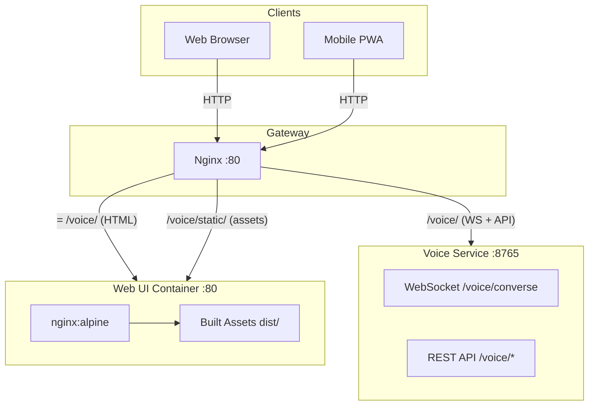
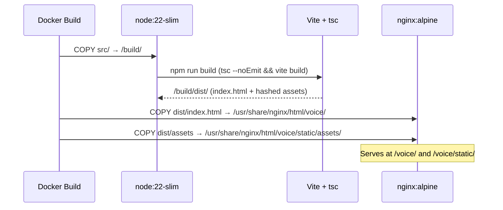

# Web UI Service

The Web UI Service serves the voice assistant's browser frontend as static files. It is a pure static hosting container — no business logic, no Python, no GPU. Its companion API backend lives in [`services/voice`](../voice/).

Built with Vite + TypeScript at container build time, served by nginx:alpine at runtime. Any client on the LAN that hits `/voice/` receives the HTML page; assets are served from `/voice/static/` with long-lived cache headers.

---

## System Design



---

## Architecture

### Build Pipeline



### URL Structure

| URL | Content | Cache |
|---|---|---|
| `/voice/` | `index.html` — SPA entry point | No cache (always fresh) |
| `/voice/static/assets/*.js` | Hashed JS bundle | 1 year immutable |
| `/voice/static/assets/*.css` | Hashed CSS bundle | 1 year immutable |

Assets use content-hashed filenames (e.g. `app-Bx3kQz1a.js`) so the 1-year cache is safe — a new build always produces new filenames.

### WebSocket Connection

The frontend connects to `ws[s]://<host>/voice/converse` at runtime. This request hits the gateway nginx, which routes it to `voice-service:8765` — the webui container never handles WebSocket traffic.

---

## Directory Structure

```
services/webui/
├── Dockerfile           Multi-stage: Node.js build → nginx:alpine serve
├── nginx.conf           Internal nginx: serves /voice/ and /voice/static/
├── .gitignore           Ignores src/node_modules/ and src/dist/
└── src/                 Vite + TypeScript source (build input)
    ├── app.ts           WebSocket client, audio recording, TTS playback, UI
    ├── index.html       HTML entry point — references ./app.ts
    ├── style.css        Dark theme styles (imported by app.ts via Vite)
    ├── package.json     npm scripts + devDependencies (Vite, TypeScript)
    ├── tsconfig.json    Strict TS config (noEmit — type checking only)
    └── vite.config.ts   base: /voice/static/, outDir: dist/
```

---

## Key Design Decisions

- **Static-only container** — nginx:alpine with no application runtime. Smallest possible attack surface and image size.
- **Multi-stage build** — Node.js is only present during the build stage; the final image contains only nginx and the compiled assets. No npm, no TypeScript in production.
- **Type checking separate from bundling** — `tsc --noEmit` validates types; Vite handles transpilation and bundling. Faster builds, no double-compilation.
- **Content-hashed assets + long cache** — Vite appends a content hash to every JS/CSS filename. Assets are cached for 1 year (`immutable`); `index.html` is never cached so clients always get the latest entry point.
- **Frontend/backend separation** — Per the project's design constraints, this container owns only static file serving. All API and WebSocket logic lives in `services/voice`.
