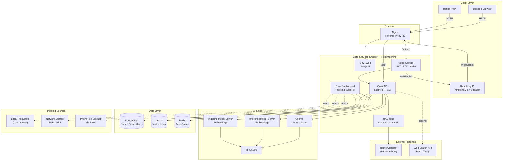

# Design Specification — Home AI Assistant

**Status:** Draft
**Version:** 0.1
**Derives from:** [functional-spec.md](functional-spec.md)

---

## 1. System Architecture

### 1.1 Component Overview



### 1.2 New Services vs Existing

| Service | Source | Purpose |
|---|---|---|
| Onyx Web, API, Background, Model Servers | Existing (Onyx) | RAG, chat, indexing |
| Ollama | Existing | LLM inference |
| PostgreSQL, Vespa, Redis, Nginx | Existing | Infra |
| **Voice Service** | **New — custom** | STT (Whisper), TTS (Piper), WebSocket relay for Pi |
| **HA Bridge** | **New — custom** | Translates assistant intent → Home Assistant REST API calls |

---

## 2. User Experience Design

### 2.1 Desktop Browser UI

Provided by Onyx out of the box. Key interactions:

```
┌─────────────────────────────────────────┐
│  🏠 Home Assistant    [Admin] [Profile]  │
├──────────┬──────────────────────────────┤
│          │                              │
│  Chats   │   Hello! How can I help?    │
│  ──────  │                              │
│  Today   │   [user message]            │
│  > Chat1 │   [assistant response]      │
│  > Chat2 │   Sources: doc1.pdf ↗       │
│          │                              │
│  Sources │                              │
│  ──────  │                              │
│  My Docs │   ┌─────────────────────┐   │
│  Photos  │   │ Type a message...🎤 │   │
│  Videos  │   └─────────────────────┘   │
│          │                              │
└──────────┴──────────────────────────────┘
```

- Mic button (🎤) in the message box activates **Voice Mode A**
- Source citations are clickable, showing the originating file or document

### 2.2 Mobile PWA UI

Mobile-optimized single-column layout:

```
┌─────────────────────┐
│ 🏠 Butler    ☰  👤  │
├─────────────────────┤
│                     │
│  Hello! How can     │
│  I help you today?  │
│                     │
│  [user message]     │
│                     │
│  [streaming         │
│   response...]      │
│                     │
│  Sources: doc1 ↗    │
│                     │
├─────────────────────┤
│ ┌─────────────┐ 🎤  │
│ │ Message...  │ 📎  │
│ └─────────────┘     │
└─────────────────────┘
```

- 🎤 activates **Voice Mode B** (foreground mic)
- 📎 opens file picker for **phone file upload**
- Installable as a PWA from the browser share menu
- Push notifications for long-running indexing jobs or assistant proactive alerts

### 2.3 Voice Interaction Flows

#### Mode A/B — Mic Button

```
User taps 🎤
    → UI shows "Listening..." with audio visualizer
    → User speaks query
    → User taps 🎤 again (or silence timeout)
    → Audio sent to Voice Service
    → Whisper transcribes → text shown in message box
    → User can edit before sending, or auto-sends after 1s
    → Response streams as normal
    → TTS plays response audio through device speaker
```

#### Mode C — Ambient (Raspberry Pi)

```
Pi mic always listening for wake word
    → "hey computer" detected locally (OpenWakeWord)
    → Pi plays a short audio chime (acknowledgement)
    → Pi streams audio to Voice Service via WebSocket
    → Silence/timeout → stream ends
    → Whisper transcribes on server
    → Sent to Onyx API as owner's message
    → Response generated by LLM
    → TTS converts response to audio on server
    → Audio streamed back to Pi via WebSocket
    → Pi plays response through speaker
```

### 2.4 Smart Home Control Flow

```
User: "hey computer, turn the bedroom lights to 50%"
    → Voice pipeline transcribes
    → Onyx API receives text, detects intent is a smart home action
    → Routes to HA Bridge instead of (or in addition to) RAG retrieval
    → HA Bridge calls Home Assistant REST API:
        POST /api/services/light/turn_on
        { entity_id: "light.bedroom", brightness_pct: 50 }
    → Home Assistant executes via Matter
    → HA Bridge returns confirmation
    → LLM generates natural language confirmation response
    → "Done — bedroom lights set to 50%"
```

---

## 3. Security & Permissions Model

### 3.1 User Roles

```
Owner
├── Full access to all connectors, sources, settings
├── Can view all users' conversation history
└── Can manage all accounts

Household Member
├── Access to sources assigned by owner
├── Private conversation history (owner can view)
└── No admin access

Child (extends Household Member)
├── Subset of sources assigned by owner
├── Content filter applied to all responses
├── Time-of-day access window enforced
└── No admin access
```

### 3.2 Data Access Profiles

The owner creates named **access profiles** and assigns them to users:

| Profile field | Description |
|---|---|
| Name | e.g. "Kids", "Adults", "Guests" |
| Allowed connectors | Which indexed sources are queryable |
| Web search enabled | Yes / No |
| Smart home access | None / Read-only / Full control |

### 3.3 Parental Controls

Applied on top of a data access profile for child accounts:

| Control | Implementation |
|---|---|
| Content filtering | System prompt injection that instructs the LLM to decline or rephrase responses on blocked topics |
| Time restrictions | API-level enforcement — requests outside the allowed window receive a "not available right now" response |
| Source restrictions | Child profile's allowed connectors is a strict subset |

---

## 4. File Indexing Pipeline

### 4.1 Data Flow

```
Source (filesystem / network share / phone upload)
    → Onyx Background Worker picks up new/modified files
    → File parsed into text chunks (by type: PDF, DOCX, MD, image metadata, video metadata)
    → Chunks embedded by Indexing Model Server
    → Embeddings stored in Vespa (vector index)
    → File metadata stored in PostgreSQL
    → At query time: user query embedded by Inference Model Server
    → Vespa returns top-k semantically similar chunks
    → Chunks injected into LLM context
    → LLM generates response citing sources
```

### 4.2 Phase 1 Indexing (filename + metadata)

| File type | What is indexed |
|---|---|
| PDF, DOCX, MD | Full extracted text |
| Photos | Filename, EXIF data (date, GPS, camera, dimensions) |
| Videos | Filename, duration, creation date, container metadata |

### 4.3 Future Deep Indexing

| File type | Future capability | Model needed |
|---|---|---|
| Photos | Object/face/scene recognition | CLIP or similar vision model |
| Videos | Audio transcription → searchable transcript | Whisper (already in stack) |

---

## 5. Voice Service Design

The Voice Service is a new lightweight service added to the Docker stack.

### 5.1 Responsibilities

- Accept audio from browser/PWA clients via HTTP POST
- Accept audio streams from Raspberry Pi via WebSocket
- Run Whisper (STT) to transcribe audio → text
- Forward text to Onyx API
- Receive text response from Onyx API
- Run Piper TTS to synthesize speech → audio
- Return audio to client (HTTP response or WebSocket stream)

### 5.2 Interfaces

| Interface | Protocol | Used by |
|---|---|---|
| `POST /voice/transcribe` | HTTP | Browser, PWA (uploads audio file) |
| `WS /voice/stream` | WebSocket | Raspberry Pi (bidirectional audio stream) |
| `POST /voice/synthesize` | HTTP | Internal — generates TTS audio from text |

### 5.3 Raspberry Pi Agent

A lightweight Python process running on the Pi:

- Runs **OpenWakeWord** locally for always-on wake word detection (minimal CPU)
- On wake word: plays chime, opens WebSocket to Voice Service, streams mic audio
- Receives TTS audio stream back, plays through speaker
- Reconnects automatically if the WebSocket drops

---

## 6. Home Assistant Bridge Design

A new lightweight service added to the Docker stack.

### 6.1 Responsibilities

- Expose a simple REST API that the Onyx API can call when a smart home intent is detected
- Translate structured intent → Home Assistant REST API calls
- Return confirmation or current device state

### 6.2 Intent Detection

The LLM is prompted with available Home Assistant entities and their capabilities. When a message is classified as a smart home intent (by the LLM or a classifier), the HA Bridge is called instead of (or alongside) RAG retrieval.

### 6.3 Interfaces

| Endpoint | Description |
|---|---|
| `GET /ha/entities` | List all known HA entities and their current state |
| `POST /ha/action` | Execute an action `{ entity_id, service, params }` |
| `GET /ha/state/{entity_id}` | Get current state of a single entity |

---

## 7. Deployment Architecture by Phase

| Phase | New components added |
|---|---|
| 1 (done) | Onyx + Ollama + infra |
| 2 | Static LAN IP, `WEB_DOMAIN` update, homelab migration |
| 3 | Host filesystem mounts, Onyx file connectors configured |
| 4 | Voice Service container (Whisper + Piper) |
| 5 | HA Bridge container, Home Assistant connection |
| 6 | Raspberry Pi agent deployed, WebSocket route in Nginx |
| 7 | Auth system expanded with household/child accounts and profiles |
| 8 | Phone upload endpoint in Voice Service or dedicated upload handler |
| 9 | SMB/NFS mounts added to docker-compose |
| 10 | Vision model service added for photo indexing |
| 11 | Web search connector configured in Onyx admin |
